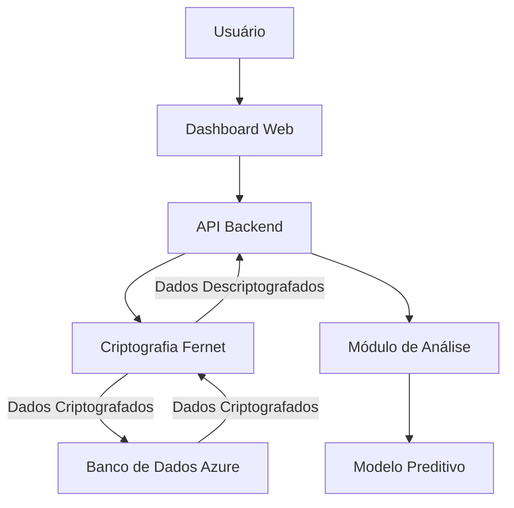

# ML Remote : Dashboard

---

## ML Remote : Dashboard PUC

**ML Remote : Dashboard**

Sistema de Machine Learning remoto com dashboard interativo para treinamento, teste e predição de modelos utilizando containers Docker e infraestrutura Azure.

🔗 **Link de Visualização (Dashboard em Produção):**
[https://remote-ml-api.mangorock-79845fa8.centralus.azurecontainerapps.io/](https://remote-ml-api.mangorock-79845fa8.centralus.azurecontainerapps.io/)

---

## 👥 Equipe

* Leonardo de camargo rosa  — 23909872 — leonardo.cr4@puccampinas.edu.br
* Nome do aluno 2 — Matrícula — E-mail
  *(Adicione mais integrantes se necessário)*

---

## 📖 Descrição Geral

### Contexto do problema

Com o avanço das tecnologias de computação em nuvem e o crescimento exponencial do volume de dados, tornou-se essencial o desenvolvimento de soluções que permitam o processamento, análise e modelagem preditiva de informações de forma remota, escalável e segura. No contexto acadêmico, observa-se a necessidade de ambientes que integrem conceitos teóricos de Machine Learning com aplicações práticas em infraestrutura real, possibilitando aos estudantes compreender o ciclo completo de um sistema inteligente em produção.

O problema central abordado neste projeto consiste na dificuldade de simular, de maneira prática, um ambiente profissional que una treinamento de modelos, armazenamento seguro de dados e visualização interativa dos resultados, utilizando arquitetura moderna baseada em nuvem.

---

### Justificativa do sistema

O desenvolvimento do **ML Remote : Dashboard** justifica-se como uma ferramenta didático-experimental voltada ao aprendizado prático sobre sistemas distribuídos, ciência de dados e inteligência artificial aplicados em nuvem. A solução permite que estudantes e pesquisadores compreendam não apenas o funcionamento de algoritmos de regressão, mas também aspectos fundamentais como:

* Integração entre backend e frontend
* Deploy em containers
* Gerenciamento de dados em nuvem
* Segurança da informação com criptografia
* Automação de processos via CI/CD

Dessa forma, o sistema contribui significativamente para a formação acadêmica, aproximando o ambiente de ensino da realidade do mercado tecnológico.

---

### Objetivos principais

* Desenvolver um sistema em nuvem capaz de treinar e gerar previsões a partir de bases de dados enviadas remotamente.
* Implementar um dashboard interativo para visualização dos resultados de treinamento e predição.
* Aplicar conceitos de Machine Learning supervisionado utilizando Regressão Linear.
* Demonstrar a aplicação prática de containers Docker em ambientes de produção.
* Integrar serviços de armazenamento Azure Blob e Table Storage.
* Garantir a segurança dos dados com criptografia Fernet.
* Automatizar o processo de build e deploy com GitHub Actions.
* Fornecer uma arquitetura completa de aprendizado sobre pipelines de dados em nuvem.

---

### Público-alvo

* Estudantes de Ciência da Computação, Engenharia de Software e áreas correlatas
* Pesquisadores em Ciência de Dados e Inteligência Artificial
* Professores que desejam demonstrar arquitetura prática de sistemas em nuvem
* Desenvolvedores em formação interessados em DevOps e Machine Learning aplicado

---

## 🗂 Dataset

### Fonte dos dados

Os dados utilizados neste projeto possuem caráter **didático e experimental**, sendo fornecidos pelo próprio usuário ou gerados de forma simulada para fins de aprendizagem acadêmica. O sistema trabalha com arquivos no formato CSV submetidos por meio do dashboard web.

* Origem: Upload manual pelo usuário via interface web
* Tipo: Dados numéricos estruturados para análise de séries temporais
* Formato: CSV

### URL / API / Dataset público

Não há dependência de datasets públicos externos. Todo o fluxo de dados ocorre internamente no ambiente do sistema, com armazenamento seguro na nuvem Microsoft Azure.

### Volume de dados esperado

Por se tratar de um projeto acadêmico e teórico, o volume de dados é considerado **baixo a moderado**, adequado para fins educacionais e testes controlados.

* Estimativa média: 100 a 5.000 registros por arquivo
* Objetivo: Demonstrar conceitos de Machine Learning e processamento em nuvem, não performance em larga escala

### Licenciamento do dataset

Os dados utilizados estão restritos ao contexto acadêmico, sendo aplicados exclusivamente para fins educacionais.

* Tipo de licenciamento: Uso educacional em ambiente Azure Acadêmico
* Finalidade: Demonstração, aprendizado e experimentação
* Restrições: Não destinado a uso comercial ou redistribuição pública

---

## 🏗 Arquitetura da Solução

Diagrama da arquitetura lógica do sistema **ML Remote : Dashboard**:

**Descrição resumida da arquitetura:**

* O **Usuário** interage com o sistema por meio do Dashboard Web.
* O Dashboard comunica-se com a **API Backend** responsável pelo processamento das requisições.
* A API gerencia o acesso ao **Banco de Dados** (Azure Blob e Table Storage).
* O **Módulo de Análise** executa o pré-processamento e tratamento dos dados.
* O **Modelo Preditivo** realiza o treinamento e geração de previsões.

---

## Demonstração

### 📸 Capturas de Tela

Insira imagens do sistema em funcionamento:

### ▶️ Vídeo de Demonstração

Link para vídeo:

* Youtube: []

---

## 📚 Referências

 Fontes utilizadas no desenvolvimento do projeto:

* Artigos científicos
* Documentação oficial
* APIs utilizadas
* Datasets

**Exemplo:**

* [https://dados.gov.br](https://dados.gov.br)
* [https://scikit-learn.org](https://scikit-learn.org)
* [https://openweathermap.org/api](https://openweathermap.org/api)

---

## Requisitos do Sistema

### Requisitos Funcionais

O sistema deverá ser capaz de:

1. Realizar upload de arquivos CSV de treino e teste através da interface web.
2. Armazenar todos os arquivos enviados em Azure Blob Storage de forma criptografada.
3. Treinar modelos de Regressão Linear utilizando dados temporais com janelas de defasagem (lags).
4. Aplicar normalização dos dados usando MinMaxScaler.
5. Executar validação cruzada temporal (TimeSeriesSplit) durante o treinamento.
6. Salvar modelos treinados e escaladores no Blob Storage de forma segura.
7. Realizar predições a partir de modelos previamente treinados.
8. Gerar métricas de avaliação (MAE, RMSE e R²).
9. Registrar métricas e logs de execução no Azure Table Storage.
10. Disponibilizar as previsões em formato CSV para download.
11. Permitir download dos arquivos tanto criptografados quanto descriptografados.
12. Exibir resultados em dashboard web integrado com gráficos de série temporal.
13. Armazenar histórico de predições no Azure Tables.
14. Fornecer endpoints REST para todas as operações (upload, treino, previsão, logs, métricas).
15. Permitir inspeção de informações da criptografia (status da chave, tamanhos criptografados vs descriptografados).

---

### Requisitos de Segurança

1. Criptografia de todos os arquivos sensíveis utilizando Fernet (cryptography).
2. Armazenamento seguro da chave criptográfica no Azure Blob Storage.
3. Proteção contra perda de dados através de versionamento em blob.
4. Controle de acesso via Secrets do GitHub e variáveis de ambiente.
5. Comunicação protegida por HTTPS na Azure Container Apps.

---

### Requisitos Não Funcionais

* Sistema escalável via containers Docker.
* Alta disponibilidade via Azure Container Apps.
* Processamento eficiente de dados temporais.
* Interface web responsiva e intuitiva.
* Logs persistentes para auditoria.
* Baixo acoplamento entre frontend e backend.
* Implantação automatizada via GitHub Actions.

---

### Infraestrutura

* Ambiente em nuvem Microsoft Azure
* Azure Blob Storage (Arquivos e modelos)
* Azure Table Storage (Logs e previsões)
* Azure Container Apps (Execução da API)
* GitHub Actions (CI/CD)
* Docker / Docker Hub (build e execução)

---

## Tecnologias Utilizadas

* Python
* Pandas
*  Azure
* FastAPI
* Github Actions
* Tables / blobstorage

---
